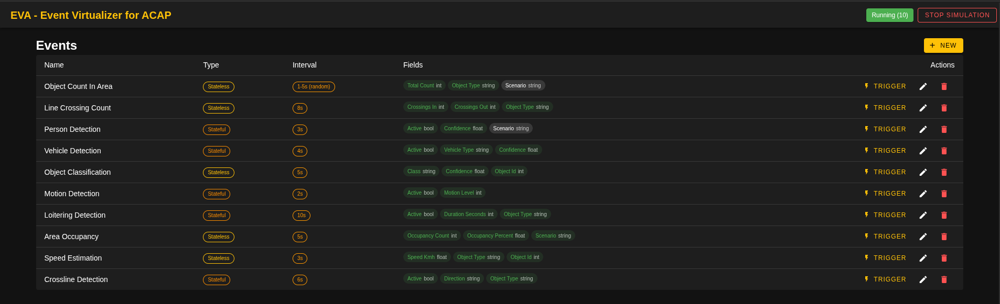

# Eva - Event Virtualizer for ACAP

Fake camera events on any Axis device.

Eva is an ACAP that lets you define custom events, register them and fire them on a schedule or with a single click. Use it to test action rules, VMS integrations, or anything else that reacts to camera events.

- **Web UI** on port `8746` to manage everything
- **SQLite** database that survives restarts
- **10 demo events** included out of the box (Axis Object Analytics style)

> [!CAUTION]
> The web server has no authentication. Anyone with network access to port 8746 can create, modify, delete, and trigger events. Only run Eva on trusted networks or behind a firewall.

## How it works

When Eva starts, it loads all saved events from the database and registers them in the camera. From there you can manage events through the web UI or REST API -- creating, updating, or deleting events will register or re-register them on the platform in real time.

Hit **Start Simulation** and every event that has an interval will start firing automatically. Intervals can be fixed (e.g. every 5 seconds) or random (a new delay between min and max is picked after each fire). You can also trigger any event manually with a single click, whether the simulation is running or not.

While the simulation is active, create/update/delete operations are blocked to keep things consistent.

Events are either **stateful** (the platform tracks active/inactive) or **stateless** (fire-and-forget). Each event carries data fields you define (string, int, float, bool) with optional randomization per field.

## Demo events



On first launch (empty database), Eva seeds 10 events inspired by Axis Object Analytics:

| Event | Type | Interval | What it simulates |
|---|---|---|---|
| Object Count In Area | stateless | 5s | Object counts with random totals (0-25) and type (Person/Vehicle/Unknown) |
| Line Crossing Count | stateless | 8s | In/out crossing counters with random counts |
| Person Detection | stateful | 1-5s (random) | Active/inactive with confidence score (0.5-1.0) |
| Vehicle Detection | stateful | 4s | Active/inactive with vehicle type (Car/Truck/Bus/Motorcycle/Bicycle) |
| Object Classification | stateless | 5s | Class label (Human/Vehicle/Animal/Unknown) with confidence and object ID |
| Motion Detection | stateful | 2s | Active/inactive with motion level (0-100) |
| Loitering Detection | stateful | 5-15s (random) | Active/inactive with duration (30-600s) and object type |
| Area Occupancy | stateless | 5s | Occupancy count and percentage across zones |
| Speed Estimation | stateless | 3s | Speed in km/h (5-120) for Person/Vehicle/Bicycle |
| Crossline Detection | stateful | 6s | Active/inactive with direction (Left to Right / Right to Left) |

These are just starting points - edit or delete them, add your own.

## Project structure

```
event_fake_acap/
  eva/                    # ACAP backend (Go)
    main.go               # Entry point
    eva.go                # App lifecycle, routes, simulation, registration
    event.go              # Event model, platform setup, demo seeding
    utils.go              # Helpers (sanitize, random generators)
    manifest.json         # ACAP package manifest
    Makefile              # Build targets (goxisbuilder)
    localdata/            # SQLite database (created at runtime)
    html/                 # Built frontend (served by the ACAP)
  frontend/               # Web UI (Vue 3 + Vuetify)
    src/
      App.vue             # Main UI - event table, create/edit dialog, sim controls
      api.ts              # Typed HTTP client for the backend API
      main.ts             # Vue app bootstrap
      plugins/            # Vuetify plugin setup
```

## Tech

**Backend:** Go 1.25, [goxis](https://github.com/Cacsjep/goxis) (ACAP SDK bindings), [Fiber v3](https://gofiber.io/) (HTTP), [GORM](https://gorm.io/) + SQLite (persistence)

**Frontend:** Vue 3, Vuetify 3, Vite 7, TypeScript

## REST API

All endpoints return JSON.

### Events

| Method | Path | Description |
|---|---|---|
| `GET` | `/events` | List all events |
| `GET` | `/events/:id` | Get a single event |
| `POST` | `/events` | Create an event (also registers it on the platform) |
| `PUT` | `/events/:id` | Update an event (re-registers on the platform) |
| `DELETE` | `/events/:id` | Delete an event (unregisters from the platform) |
| `POST` | `/events/:id/trigger` | Fire a single event immediately |

Create/update/delete return **409** if the simulation is running.

### Simulation

| Method | Path | Description |
|---|---|---|
| `POST` | `/simulation/start` | Start firing all interval-based events |
| `POST` | `/simulation/stop` | Stop the simulation |
| `GET` | `/simulation/status` | Check if simulation is running and event count |

### Event payload shape

```json
{
  "name": "Person Detection",
  "use_interval": true,
  "interval_seconds": 3,
  "use_random_interval": false,
  "interval_min_seconds": 0,
  "interval_max_seconds": 0,
  "stateless": false,
  "DataFields": [
    {
      "name": "Active",
      "value": true,
      "value_type": "bool",
      "use_random": true,
      "int_rand_start": 0,
      "int_rand_end": 0,
      "float_rand_start": 0,
      "float_rand_end": 0,
      "random_strings": []
    },
    {
      "name": "Confidence",
      "value": 0.85,
      "value_type": "float",
      "use_random": true,
      "float_rand_start": 0.5,
      "float_rand_end": 1.0,
      "int_rand_start": 0,
      "int_rand_end": 0,
      "random_strings": []
    }
  ]
}
```

**Supported `value_type`s:** `string`, `int`, `float`, `bool`

When `use_random_interval` is `true`, `interval_seconds` is ignored and the event fires at a random delay between `interval_min_seconds` and `interval_max_seconds` (a new delay is picked after each fire).

When `use_random` is `true` on a data field:
- **int** - random value between `int_rand_start` and `int_rand_end`
- **float** - random value between `float_rand_start` and `float_rand_end`
- **string** - random pick from `random_strings` array
- **bool** - coin flip

## Point it at your camera

Two files need your camera's IP before you can develop:

**`eva/Makefile`** -- goxisbuilder uses `-ip` and `-pwd` to deploy the ACAP straight to your camera over SSH. Change them to match your device:

```makefile
# in eva/Makefile
goxisbuilder -install -ip 10.0.0.48 -sdk "12.5.0" -pwd 1qay2wsx ...
#                         ^^^^^^^^^^                    ^^^^^^^^
#                         your camera IP                your root password
```

**`frontend/vite.config.ts`** -- the Vite dev server proxies `/api` requests to Eva running on the camera, so you get hot reload on the frontend while it talks to the real backend. Update the `target` to the same IP:

```ts
proxy: {
  '/api': {
    target: 'http://10.0.0.48:8746',  // <-- your camera IP
    ...
  },
},
```

## Development setup

### Prerequisites

- [goxisbuilder](https://github.com/Cacsjep/goxis) installed
- Docker (goxisbuilder uses it for cross-compilation)
- Node.js 24+ (for the frontend)

### Frontend

```bash
cd frontend
npm install
npm run build    # builds into eva/html/
npm run dev      # or run the Vite dev server with hot reload (proxies API to camera)
```

### Backend (ACAP)

```bash
cd eva

# Development - watches for changes, auto-builds and deploys to camera
make dev

# One-off production build and deploy
make build
```

Both Makefile targets use `goxisbuilder` which spins up an SDK Docker container, cross-compiles for the camera architecture, packages the `.eap`, and installs it on the device via SSH.

### CI

Push a `v*` tag and the GitHub Actions workflow builds `.eap` packages for **aarch64** and **armv7hf**, then creates a release with both artifacts zipped up.

## How events appear on the camera

Each event is registered under the application namespace `eva` with a sanitized name (lowercased, spaces removed). In the camera's event system they show up as:

```
Eva - Person Detection
Eva - Object Count In Area
Eva - Motion Detection
...
```

You can use them in the camera's action rule engine, subscribe to them via ONVIF, or consume them from a VMS - just like real analytics events.

## Changelog

### 0.0.5
- Added random interval support (`use_random_interval`, `interval_min_seconds`, `interval_max_seconds`) -- events can now fire at a random delay between min and max instead of a fixed cadence
- Reworked UI from card grid to compact table layout for the event list
- Redesigned create/edit dialog with inline row-based form for data fields
- Updated demo events: Person Detection (1-5s random) and Loitering Detection (5-15s random) now showcase random intervals

### 0.0.4
- Updated NiceName formatting in SetupPlatformEvent method

### 0.0.3
- Refactored code structure for improved readability and maintainability
- Renamed application to "Eva - Event Virtualizer for ACAP"

### 0.0.2
- Updated build command and manifest version

### 0.0.1
- Initial release with Vue 3 + Vuetify frontend
- 10 demo events seeded on first launch
- Fixed and manual event triggering
- REST API for full CRUD + simulation control

## License

MIT - see [LICENSE](eva/LICENSE).
